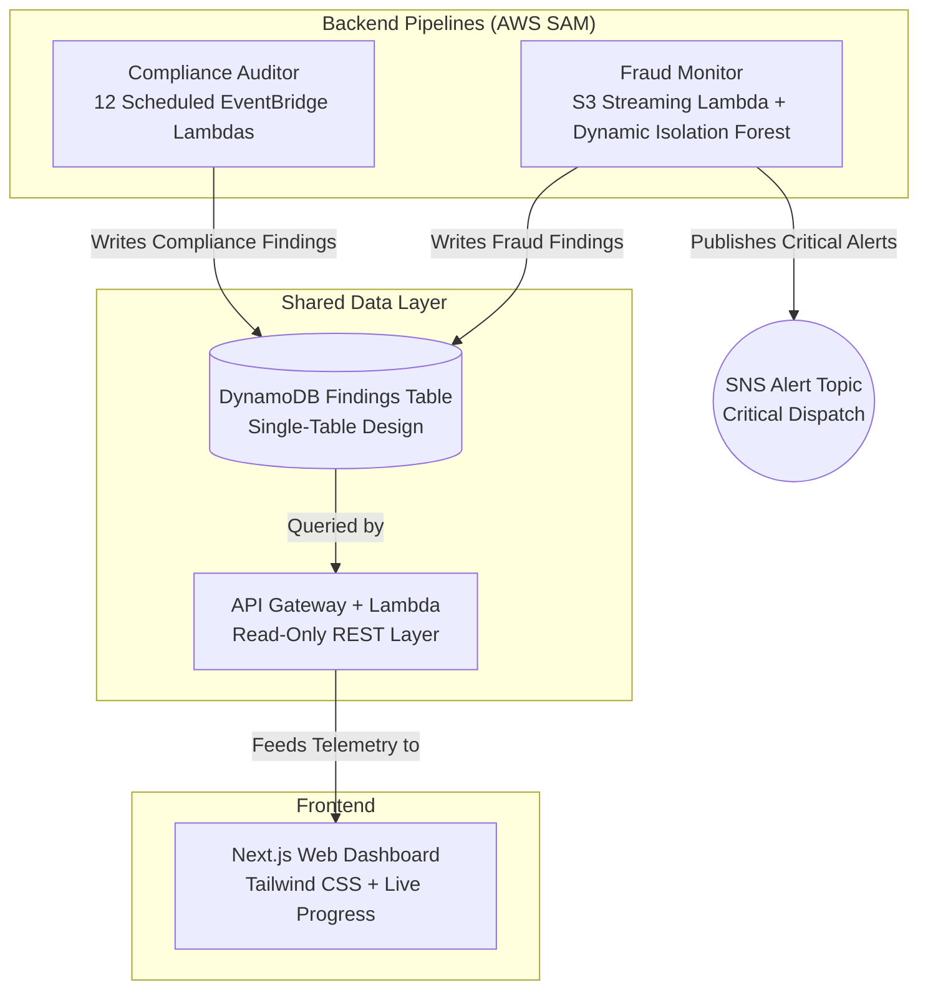

# BankGuard: Unified Security & Fraud Automation

**A cloud-native data pipeline demonstrating applied AWS security, machine learning, and full-stack integration.**

BankGuard unifies two critical banking defense pipelines—a **Cloud Compliance Auditor** evaluating infrastructure against strict CIS benchmarks and a **Transaction Fraud Monitor** executing machine learning anomaly detection on financial records—reporting into a single DynamoDB data layer and surfaced through a high-fidelity Next.js web dashboard.

Every metric and alert shown on the dashboard reflects real AWS API audits and batch transactions processed through applied machine learning.

---

## 🏗️ Architecture at a Glance

---

## 🚀 The Core Components

### 1. Compliance Auditor ([`/compliance-auditor`](compliance-auditor/README.md))
A fleet of 12 scheduled AWS Lambda functions evaluating live AWS account configurations against the **CIS AWS Foundations Benchmark v3.0**:
- **Identity & Access Management (IAM):** Root MFA enforcement, root active access key audits, IAM user console MFA, 90-day access key rotation, and direct admin policy restrictions.
- **Storage & Encryption (S3 & EBS):** S3 bucket public access blocks, default S3 server-side encryption, and account-level default EBS volume encryption.
- **Logging & Visibility (CloudTrail):** Multi-region CloudTrail audit logging and CloudTrail log file KMS encryption validation.
- **Network Security (VPC Security Groups):** Unrestricted SSH (22) / RDP (3389) ingress checks and default security group traffic isolation.

### 2. Fraud Monitor ([`/fraud-monitor`](fraud-monitor/README.md))
A high-throughput serverless batch processing pipeline triggered automatically on S3 CSV uploads:
- **Heuristic Rule Engine:** Evaluates velocity spikes, high-risk merchant categories (crypto exchanges, casinos, luxury goods), and abnormal amount deviations.
- **Dynamic Isolation Forest ML:** Dynamically learns and fits an `IsolationForest` model on newly uploaded transaction batches containing PCA features (`V1`..`V28`), hot-reloading the model in memory to score outliers.
- **Explainable Anomaly Telemetry:** Identifies and ranks the top PCA features driving high anomaly scores for clear auditability.
- **Critical SNS Alerts:** Dispatches immediate notifications for transactions flagged by both heuristics and machine learning.

### 3. API Layer ([`/api`](api/README.md))
A centralized "Lambda Lith" REST API serving the Next.js frontend:
- **Endpoints:** `/overview-data`, `/findings`, `/findings/{id}`, `/processing-status/{id}`, and `/upload-url`.
- **Security & Reliability:** Path traversal input sanitization, full DynamoDB scan/query pagination across 1MB limits, S3 Presigned POST ticket generation (supporting up to 1GB files), and CORS preflight handling.

### 4. Web Dashboard ([`/frontend`](frontend/README.md))
A modern, dark-mode dashboard built with **Next.js** and **Tailwind CSS**:
- **Unified Overview:** High-level telemetry cards for Critical/High fraud and compliance risks.
- **Direct S3 Uploads:** In-browser XHR direct-to-S3 upload with real-time byte progress and backend AI job processing monitors.
- **Fail-Safe UI:** Explicit error banners preventing false assurance during API downtime.

---

## 🧠 Engineering Documentation

- [**Decisions Log**](docs/decisions.md): Tradeoff analysis and architecture decisions made during construction (Single-Table design, Isolation Forest vs Deep Learning, SAM IaC, Dynamic Retraining).
- [**Challenges Log**](docs/challenges.md): Technical hurdles encountered and resolved (Lambda 250MB ML packaging limits, S3 Presigned POST OS quirks, Isolation Forest mathematical calibration, and pagination).

---

## 🛠️ Setup & Deployment

Detailed setup and deployment instructions are available in each component directory:
- [Compliance Auditor Guide](compliance-auditor/README.md)
- [Fraud Monitor Guide](fraud-monitor/README.md)
- [API Layer Guide](api/README.md)
- [Frontend Dashboard Guide](frontend/README.md)
