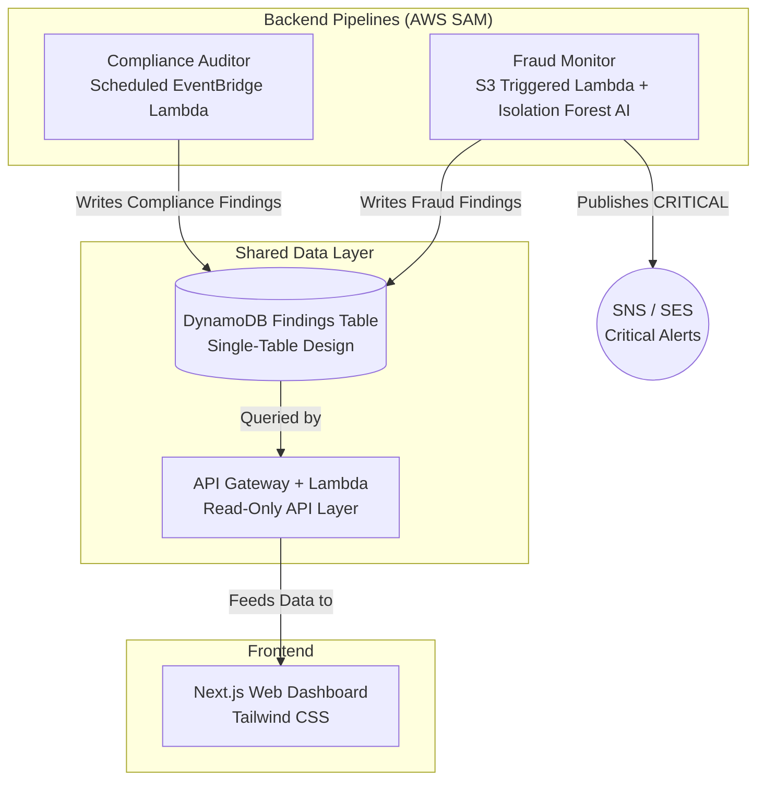

# BankGuard: Unified Security & Fraud Automation

**A cloud-native data pipeline demonstrating applied AWS security, machine learning, and full-stack integration.**

This project consists of two independent backend pipelines (a Cloud Compliance Auditor and a Transaction Fraud Monitor) that report into a single, unified database. The results are surfaced through a modern Next.js web dashboard designed for instant legibility.

Every number shown on the frontend comes from a Lambda that actually ran against real AWS configuration APIs or a real (batch-processed) Kaggle fraud dataset.

---

## 🏗️ Architecture at a Glance

## 🚀 The Components

1. **Compliance Auditor (`/compliance-auditor`)**: A scheduled Lambda function that automatically evaluates this AWS account against 12 strict CIS AWS Foundations Benchmark controls (e.g., Root MFA, S3 Encryption, CloudTrail logging). 
2. **Fraud Monitor (`/fraud-monitor`)**: A batch data pipeline that scans CSV transaction dumps. It applies simple heuristics (Velocity, High-Risk Merchants) and an **Isolation Forest** machine learning model to detect anomalies and calculate a Risk Score.
3. **Shared API (`/api`)**: A lightweight, read-only "Lambda Lith" API Gateway that securely fetches paginated data and summary stats from DynamoDB.
4. **Web Dashboard (`/frontend`)**: A React/Next.js interface allowing non-technical stakeholders to view the live health of the cloud infrastructure and recent fraudulent activity in one unified pane of glass.

## 🧠 Engineering Decisions & Challenges

Why build it this way? See the [**Decisions Log**](docs/decisions.md) for a deep dive into the engineering tradeoffs made during this project, including:
- Why we used a Single-Table DynamoDB design for two vastly different data shapes.
- Why we chose an Isolation Forest over deep learning.
- Why we used AWS SAM.
- Why the API uses a "Lambda Lith" pattern.

What went wrong while building it? See the [**Challenges Log**](docs/challenges.md) for a candid look at the technical hurdles we faced, including:
- Fighting the 250MB AWS Lambda limit with Machine Learning libraries.
- Debugging S3 Presigned POST quirks across operating systems.
- Calibrating Scikit-Learn IsolationForest anomaly thresholds.
- Recovering from silent failures and artifact desynchronization.

## 🛠️ How to run it

Detailed setup instructions are inside each component's folder:
- [Compliance Auditor Instructions](compliance-auditor/README.md)
- [Fraud Monitor Instructions](fraud-monitor/README.md)
- [API Layer Instructions](api/README.md)
- [Frontend Dashboard Instructions](frontend/README.md)
